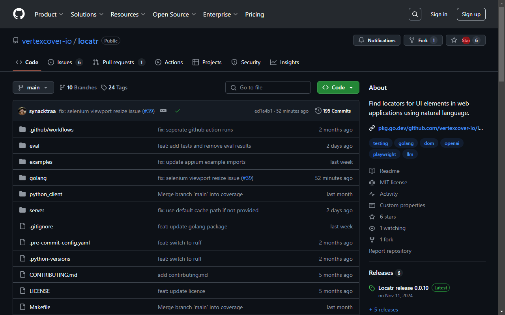

# Locatr

Find locators for UI elements in web applications using natural language.

```bash
go get github.com/vertexcover-io/locatr/pkg
```

## TOC
- [Plugin Support](#plugin-support)
- [Usage](#usage)
  - [Initialize an automation plugin](#initialize-an-automation-plugin-of-your-choice)
    - [Playwright](#playwright)
    - [Selenium](#selenium)
    - [Appium](#appium)
  - [Create a Locatr instance](#create-a-locatr-instance)
    - [With a custom LLM client](#with-a-custom-llm-client)
    - [With a custom reranker client](#with-a-custom-reranker-client)
    - [With a custom mode](#with-a-custom-mode)
    - [With cache enabled](#with-cache-enabled)
  - [Locate an element](#locate-an-element)
  - [Calculate the total cost](#calculate-the-total-cost-of-the-completion)
  - [Highlight the locator](#highlight-the-locator)

## Plugin Support

> The following table shows the supported modes for each automation plugin.

| Plugin     | DOM Analysis | Visual Analysis |
|------------|-------------|-----------------|
| Playwright | ✅          | ✅              |
| Selenium   | ✅          | ✅              |
| Appium     | ✅          | ⚠️ Experimental |

## Usage

### Initialize an automation plugin of your choice.

#### Playwright
<details>
<summary>Set up a Playwright page</summary>

```go
import (
    "log"

    "github.com/playwright-community/playwright-go"
)

pw, err := playwright.Run()
if err != nil {
    log.Fatalf("could not start Playwright: %v", err)
}

// --- Launch a browser ---
browser, err := pw.Chromium.Launch(
    playwright.BrowserTypeLaunchOptions{Headless: playwright.Bool(false)},
)
// OR, --- Connect to a browser over CDP ---
browser, err := pw.Chromium.ConnectOverCDP("<cdp-session-url>")

if err != nil {
    log.Fatalf("could not connect to browser: %v", err)
}

browserContext, err := browser.NewContext(
    playwright.BrowserNewContextOptions{BypassCSP: playwright.Bool(true)},
)
if err != nil {
    log.Fatalf("could not create browser context: %v", err)
}

page, err := browserContext.NewPage()
if err != nil {
    log.Fatalf("could not create new page: %v", err)
}

if _, err := page.Goto("https://github.com/vertexcover-io/locatr"); err != nil {
    log.Fatalf("failed to load URL: %v", err)
}
```
</details>

```go
import "github.com/vertexcover-io/locatr/pkg/plugins"

plugin, err := plugins.NewPlaywrightPlugin(&page)
```

#### Selenium

> Note: Make sure to use `--force-device-scale-factor=1` flag when creating the driver for visual analysis mode to work correctly.

<details>
<summary>Set up a Selenium driver</summary>

```go
import (
    "log"

    "github.com/vertexcover-io/selenium"
    "github.com/vertexcover-io/selenium/chrome"
)
service, err := selenium.NewChromeDriverService(
    "path/to/chromedriver-executable", 4444,
)
if err != nil {
    log.Fatalf("failed to create service: %v", err)
}

caps := selenium.Capabilities{}
caps.AddChrome(chrome.Capabilities{Args: []string{"--force-device-scale-factor=1"}})

driver, err := selenium.NewRemote(caps, "")
// OR, --- Connect to a remote driver session---
driver, err := selenium.ConnectRemote("<url>", "<session-id>")

if err != nil {
    log.Fatalf("could not connect to driver: %v", err)
}

if err := driver.Get("https://github.com/vertexcover-io/locatr"); err != nil {
    log.Fatalf("failed to load URL: %v", err)
}
```
</details>

```go
import "github.com/vertexcover-io/locatr/pkg/plugins"

plugin, err := plugins.NewSeleniumPlugin(&driver)
```

#### Appium

```go
import "github.com/vertexcover-io/locatr/pkg/plugins"

// --- Pass capabilities to create a new session ---
plugin, err := plugins.NewAppiumPlugin(
    "<appium-server-url>", 
    map[string]any{
        "platformName": "Android",
        "automationName": "UiAutomator2",
        "deviceName": "emulator-5554",
        "appPackage": "com.google.android.deskclock",
        "appActivity": "com.android.deskclock.DeskClock",
        "language": "en",
        "locale": "US",
    },
)
// OR, --- Connect to an existing session ---
plugin, err := plugins.NewAppiumPlugin(
    "<appium-server-url>", "<appium-session-id>",
)
```

### Create a Locatr instance

```go
import (
    "log"

    locatr "github.com/vertexcover-io/locatr/pkg"
)

locatr, err := locatr.NewLocatr(plugin)
```

> By default, anthropic's `claude-3-5-sonnet-latest` LLM and cohere's `rerank-english-v3.0` reranker are used.


#### With a custom LLM client

```go
import (
    locatr "github.com/vertexcover-io/locatr/pkg"
    "github.com/vertexcover-io/locatr/pkg/llm"
)

llmClient, err := llm.NewLLMClient(
    llm.WithProvider(llm.OpenAI),
    llm.WithModel("gpt-4o"),
    llm.WithAPIKey("<openai-api-key>"),
)

locatr, err := locatr.NewLocatr(
    plugin, locatr.WithLLMClient(llmClient),
)
```

#### With a custom reranker client

```go
import (
    locatr "github.com/vertexcover-io/locatr/pkg"
    "github.com/vertexcover-io/locatr/pkg/reranker"
)

rerankerClient, err := reranker.NewRerankerClient(
    reranker.WithProvider(reranker.Cohere),
    reranker.WithModel("rerank-english-v3.0"),
    reranker.WithAPIKey("<cohere-api-key>"),
)

locatr, err := locatr.NewLocatr(
    plugin,
    locatr.WithRerankerClient(rerankerClient),
)
```

---

#### With a custom mode

> By default, `mode.DOMAnalysisMode` is used.

```go
import (
    locatr "github.com/vertexcover-io/locatr/pkg"
    "github.com/vertexcover-io/locatr/pkg/mode"
)

mode := mode.VisualAnalysisMode{
    MaxAttempts: 3,
    Resolution: &types.Resolution{
        Width:  1280,
        Height: 800,
    },
}

locatr, err := locatr.NewLocatr(
    plugin, locatr.WithMode(mode),
)
```

#### With cache enabled

```go
import (
    locatr "github.com/vertexcover-io/locatr/pkg"
)

locatr, err := locatr.NewLocatr(
    plugin, locatr.EnableCache(nil), // defaults to .locatr.cache, pass a path to use a different cache file
)
```

</details>

### Locate an element

```go
completion, err := locatr.Locate(
    context.Background(), "Star button",
)
if err != nil {
    log.Fatalf("failed to locate element: %v", err)
}
fmt.Println(completion.Locators[0])
```

### Calculate the total cost of the completion

```go
// $1.0 per 1M input tokens, $1.0 per 1M output tokens
cost := completion.CalculateCost(1.0, 1.0)
fmt.Printf("Cost: %v\n", cost)
```

### Highlight the locator

```go
imageBytes, err := locatr.Highlight(
    context.Background(), 
    completion.Locators[0], 
    nil,
)
if err != nil {
    log.Fatalf("failed to highlight element: %v", err)
}

// Write the image to a file
os.WriteFile("highlighted.png", imageBytes, 0644)
```


