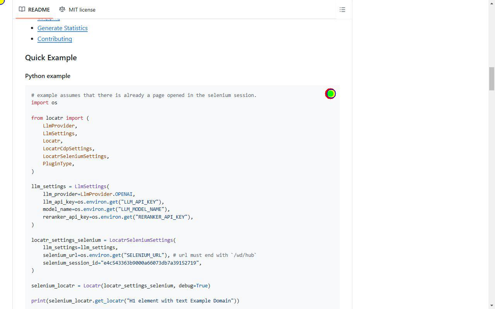
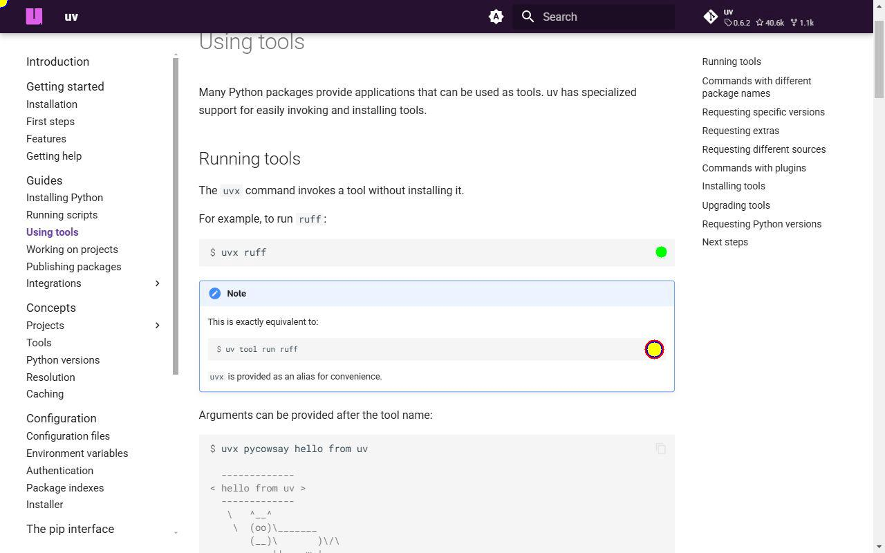
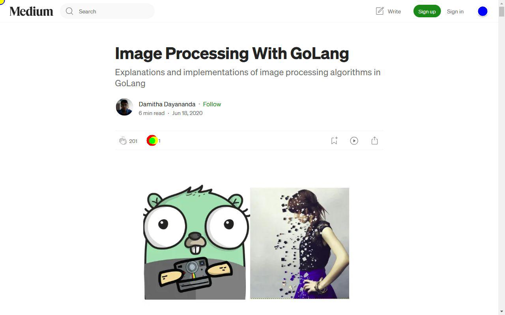
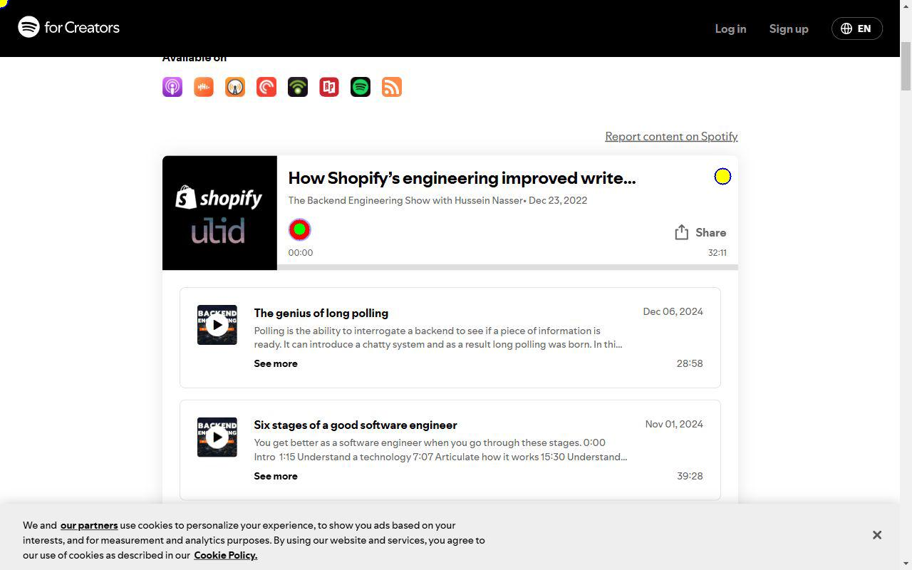

# URL: https://www.amazon.com/

## Entry 1

**Description**: Image element containing characters to solve the captcha

**Coordinates**: X=640, Y=336.1750183105469

**Scroll To**: X=0, Y=0

#### `anthropicGroundingLocatr`
- Generated Points:
  - Point 1: X=640, Y=325

- Input Tokens: 1741
- Output Tokens: 41
- Total Tokens: 1782

#### `originalLocatrWithReranking`
- Generated Points:
  - Point 1: X=0, Y=0
  - Point 2: X=0, Y=0
  - Point 3: X=0, Y=0
  - Point 4: X=640, Y=336.1750183105469
  - Point 5: X=640, Y=336.1750183105469
  - Point 6: X=640, Y=336.1750183105469

- Input Tokens: 1902
- Output Tokens: 15
- Total Tokens: 1917

#### `originalLocatrWithoutReranking`
- Generated Points:
  - Point 1: X=0, Y=0
  - Point 2: X=0, Y=0
  - Point 3: X=0, Y=0
  - Point 4: X=640, Y=336.1750183105469
  - Point 5: X=640, Y=336.1750183105469
  - Point 6: X=640, Y=336.1750183105469

- Input Tokens: 1902
- Output Tokens: 15
- Total Tokens: 1917

### Annotated Screenshot

---

# URL: https://github.com/vertexcover-io/locatr

## Entry 1

**Description**: Clickable element to copy the python example

**Coordinates**: X=854.4000244140625, Y=242.4499969482422

**Scroll To**: X=0, Y=2100

#### `anthropicGroundingLocatr`
- Generated Points:
  - Point 1: X=854, Y=242

- Input Tokens: 1741
- Output Tokens: 41
- Total Tokens: 1782

#### `originalLocatrWithReranking`
- Generated Points:
  - Point 1: X=0, Y=0
  - Point 2: X=0, Y=0
  - Point 3: X=0, Y=0
  - Point 4: X=856.4000244140625, Y=242.45000457763672
  - Point 5: X=856.4000244140625, Y=242.45000457763672

- Input Tokens: 1946
- Output Tokens: 15
- Total Tokens: 1961

#### `originalLocatrWithoutReranking`
- Generated Points:
  - Point 1: X=0, Y=0
  - Point 2: X=0, Y=0
  - Point 3: X=0, Y=0
  - Point 4: X=856.4000244140625, Y=242.45000457763672
  - Point 5: X=856.4000244140625, Y=242.45000457763672

- Input Tokens: 1946
- Output Tokens: 20
- Total Tokens: 1966

### Annotated Screenshot

---

# URL: https://www.youtube.com/playlist?list=PLS01nW3RtgopsNLeM936V4TNSsvvVglLc

## Entry 1

**Description**: Button to save the playlist

**Coordinates**: X=326, Y=445.5

**Scroll To**: X=0, Y=0

#### `anthropicGroundingLocatr`
- Generated Points:
  - Point 1: X=326, Y=445

- Input Tokens: 1737
- Output Tokens: 41
- Total Tokens: 1778

#### `originalLocatrWithReranking`
- Generated Points:
  - Point 1: X=0, Y=0
  - Point 2: X=0, Y=0
  - Point 3: X=0, Y=0
  - Point 4: X=326, Y=445.5
  - Point 5: X=326, Y=445.5
  - Point 6: X=326, Y=445.5

- Input Tokens: 4042
- Output Tokens: 20
- Total Tokens: 4062

#### `originalLocatrWithoutReranking`
- Generated Points:
  - Point 1: X=0, Y=0
  - Point 2: X=0, Y=0
  - Point 3: X=0, Y=0
  - Point 4: X=326, Y=445.5
  - Point 5: X=326, Y=445.5
  - Point 6: X=326, Y=445.5

- Input Tokens: 4305
- Output Tokens: 14
- Total Tokens: 4319

### Annotated Screenshot

## Entry 2

**Description**: Button to share the playlist

**Coordinates**: X=370, Y=445.5

**Scroll To**: X=0, Y=0

#### `anthropicGroundingLocatr`
- Generated Points:
  - Point 1: X=369, Y=445

- Input Tokens: 1737
- Output Tokens: 41
- Total Tokens: 1778

#### `originalLocatrWithReranking`
- Generated Points:
  - Point 1: X=0, Y=0
  - Point 2: X=0, Y=0
  - Point 3: X=0, Y=0
  - Point 4: X=370, Y=445.5
  - Point 5: X=370, Y=445.5
  - Point 6: X=370, Y=445.5

- Input Tokens: 4305
- Output Tokens: 20
- Total Tokens: 4325

#### `originalLocatrWithoutReranking`
- Generated Points:
  - Point 1: X=0, Y=0
  - Point 2: X=0, Y=0
  - Point 3: X=0, Y=0
  - Point 4: X=370, Y=445.5
  - Point 5: X=370, Y=445.5
  - Point 6: X=370, Y=445.5

- Input Tokens: 4033
- Output Tokens: 14
- Total Tokens: 4047

### Annotated Screenshot

---

# URL: https://docs.astral.sh/uv/guides/tools/

## Entry 1

**Description**: Clickable element to copy command for running tools using uv

**Coordinates**: X=946.0000247955322, Y=505.987512588501

**Scroll To**: X=0, Y=100

#### `anthropicGroundingLocatr`
- Generated Points:
  - Point 1: X=956, Y=364

- Input Tokens: 1745
- Output Tokens: 44
- Total Tokens: 1789

#### `originalLocatrWithReranking`
- Generated Points:
  - Point 1: X=0, Y=0
  - Point 2: X=0, Y=0
  - Point 3: X=0, Y=0
  - Point 4: X=946.0000305175781, Y=505.9875183105469
  - Point 5: X=946.0000305175781, Y=505.9875183105469
  - Point 6: X=946.0000305175781, Y=505.9875183105469

- Input Tokens: 4568
- Output Tokens: 22
- Total Tokens: 4590

#### `originalLocatrWithoutReranking`
- Generated Points:
  - Point 1: X=0, Y=0
  - Point 2: X=0, Y=0
  - Point 3: X=0, Y=0
  - Point 4: X=946.0000305175781, Y=505.9875183105469
  - Point 5: X=946.0000305175781, Y=505.9875183105469
  - Point 6: X=946.0000305175781, Y=505.9875183105469

- Input Tokens: 4568
- Output Tokens: 23
- Total Tokens: 4591

### Annotated Screenshot

---

# URL: https://medium.com/@damithadayananda/image-processing-with-golang-8f20d2d243a2

## Entry 1

**Description**: Clickable element for opening the comment section

**Coordinates**: X=385.6000061035156, Y=356.4750061035156

**Scroll To**: X=0, Y=0

#### `anthropicGroundingLocatr`
- Generated Points:
  - Point 1: X=385, Y=357

- Input Tokens: 1741
- Output Tokens: 42
- Total Tokens: 1783

#### `originalLocatrWithReranking`
- Generated Points:
  - Point 1: X=0, Y=0
  - Point 2: X=0, Y=0
  - Point 3: X=0, Y=0
  - Point 4: X=390.0500030517578, Y=356.4750061035156
  - Point 5: X=390.0500030517578, Y=356.4750061035156
  - Point 6: X=390.0500030517578, Y=356.4750061035156

- Input Tokens: 58311
- Output Tokens: 18
- Total Tokens: 58329

#### `originalLocatrWithoutReranking`
- Generated Points:
  - Point 1: X=0, Y=0
  - Point 2: X=0, Y=0
  - Point 3: X=0, Y=0
  - Point 4: X=1223.2000732421875, Y=28.100001335144043
  - Point 5: X=1223.2000732421875, Y=28.100001335144043
  - Point 6: X=1223.2000732421875, Y=28.100001335144043

- Input Tokens: 58311
- Output Tokens: 19
- Total Tokens: 58330

### Annotated Screenshot

---

# URL: https://creators.spotify.com/pod/show/hnasr/episodes/How-Shopifys-engineering-improved-writes-by-50-with-ULID--The-Backend-Engineering-Show-e1sk3tv

## Entry 1

**Description**: Button to play the podcast

**Coordinates**: X=420.6000061035156, Y=322.6000061035156

**Scroll To**: X=0, Y=500

#### `anthropicGroundingLocatr`
- Generated Points:
  - Point 1: X=420, Y=321

- Input Tokens: 1737
- Output Tokens: 41
- Total Tokens: 1778

#### `originalLocatrWithReranking`
- Generated Points:
  - Point 1: X=0, Y=0
  - Point 2: X=0, Y=0
  - Point 3: X=0, Y=0
  - Point 4: X=1014.3500366210938, Y=247.65000915527344
  - Point 5: X=1014.3500366210938, Y=247.65000915527344
  - Point 6: X=1014.3500366210938, Y=247.65000915527344

- Input Tokens: 4672
- Output Tokens: 14
- Total Tokens: 4686

#### `originalLocatrWithoutReranking`
- Generated Points:
  - Point 1: X=0, Y=0
  - Point 2: X=0, Y=0
  - Point 3: X=0, Y=0
  - Point 4: X=1014.3500366210938, Y=247.65000915527344
  - Point 5: X=1014.3500366210938, Y=247.65000915527344
  - Point 6: X=1014.3500366210938, Y=247.65000915527344

- Input Tokens: 4946
- Output Tokens: 19
- Total Tokens: 4965

### Annotated Screenshot

---

# URL: https://www.hackerone.com/

## Entry 1

**Description**: Locate GoodPx section

**Coordinates**: X=531.6000061035156, Y=353.20001220703125

**Scroll To**: X=0, Y=3700

#### `anthropicGroundingLocatr`
- Generated Points:
  - Point 1: X=530, Y=440

- Input Tokens: 1739
- Output Tokens: 44
- Total Tokens: 1783

#### `originalLocatrWithReranking`
- Generated Points:
  - Point 1: X=0, Y=0
  - Point 2: X=0, Y=0
  - Point 3: X=0, Y=0
  - Point 4: X=931.6000061035156, Y=353.20001220703125
  - Point 5: X=331.6000061035156, Y=353.20001220703125

- Input Tokens: 4646
- Output Tokens: 19
- Total Tokens: 4665

#### `originalLocatrWithoutReranking`
- Generated Points:
  - Point 1: X=0, Y=0
  - Point 2: X=0, Y=0
  - Point 3: X=0, Y=0
  - Point 4: X=1904.8001098632812, Y=604.2000122070312
  - Point 5: X=631.6000366210938, Y=626.2000122070312

- Input Tokens: 4646
- Output Tokens: 15
- Total Tokens: 4661

### Annotated Screenshot

## Entry 2

**Description**: Locate HYATT section

**Coordinates**: X=731.6000366210938, Y=353.20001220703125

**Scroll To**: X=0, Y=3700

#### `anthropicGroundingLocatr`
- Generated Points:
  - Point 1: X=730, Y=353

- Input Tokens: 1738
- Output Tokens: 41
- Total Tokens: 1779

### Annotated Screenshot

---

# URL: https://www.shein.co.uk/

## Entry 1

**Description**: Button to contact customer service

**Coordinates**: X=1168.2000732421875, Y=76.02625179290771

**Scroll To**: X=0, Y=0

#### `anthropicGroundingLocatr`
- Generated Points:
  - Point 1: X=1167, Y=75

- Input Tokens: 1737
- Output Tokens: 45
- Total Tokens: 1782

### Annotated Screenshot

## Entry 2

**Description**: Icon to shop at 60% discount

**Coordinates**: X=1227.2000732421875, Y=673.5

**Scroll To**: X=0, Y=500

#### `anthropicGroundingLocatr`
- Generated Points:
  - Point 1: X=1236, Y=656

- Input Tokens: 1740
- Output Tokens: 45
- Total Tokens: 1785

#### `originalLocatrWithoutReranking`
- Generated Points:
  - Point 1: X=0, Y=0
  - Point 2: X=0, Y=0
  - Point 3: X=0, Y=0
  - Point 4: X=153.58124923706055, Y=566.4062652587891
  - Point 5: X=153.58124923706055, Y=566.4062652587891
  - Point 6: X=153.58124923706055, Y=566.4062652587891

- Input Tokens: 76462
- Output Tokens: 19
- Total Tokens: 76481

### Annotated Screenshot

---

