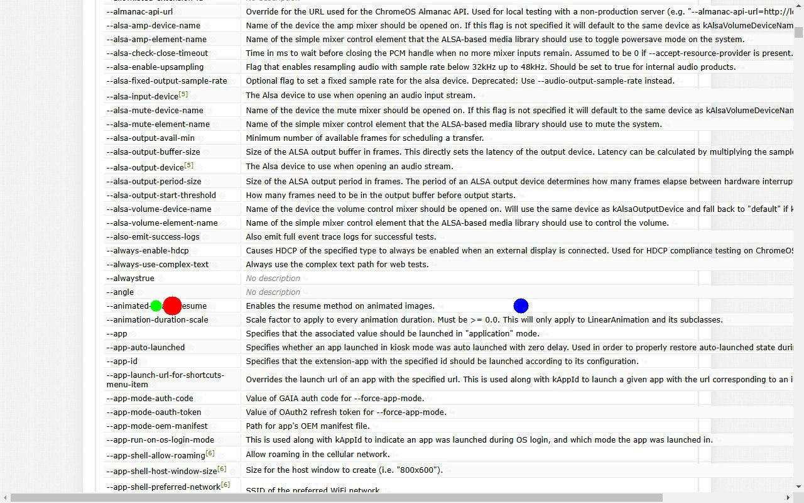
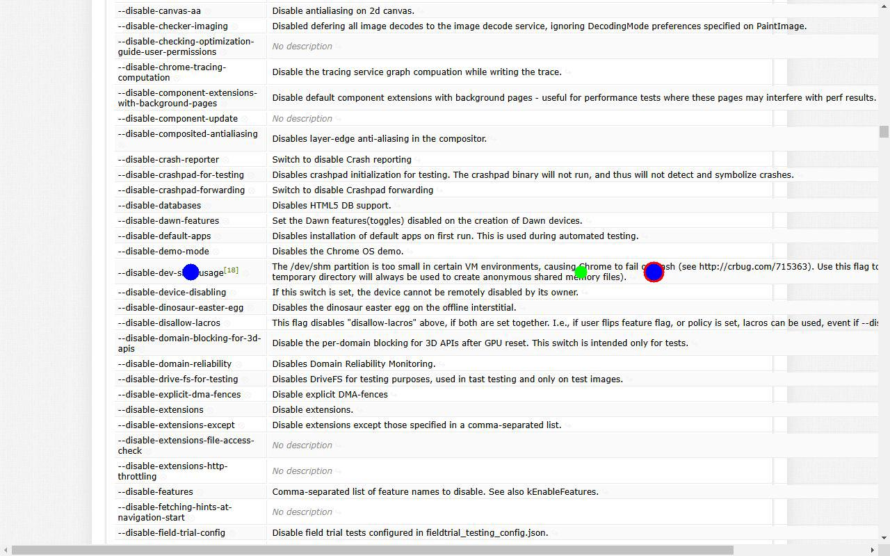
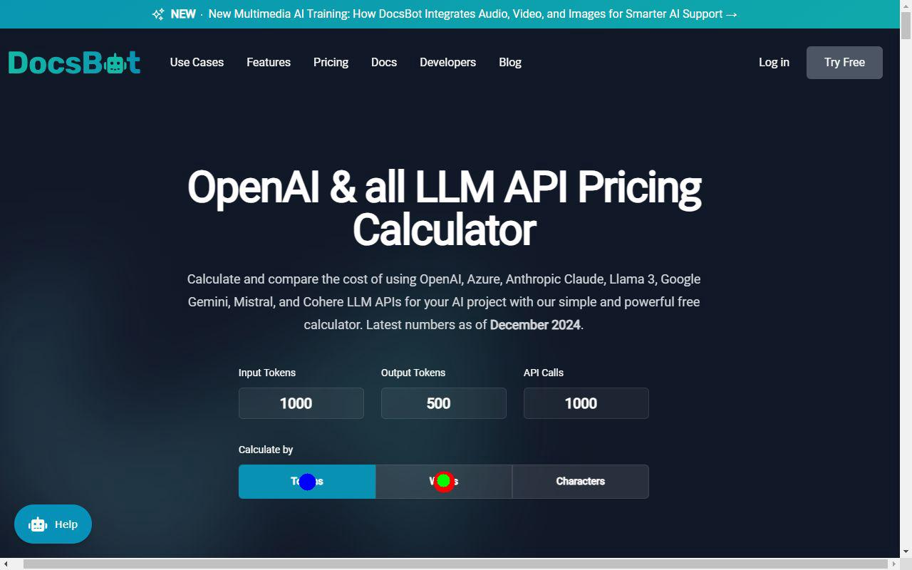
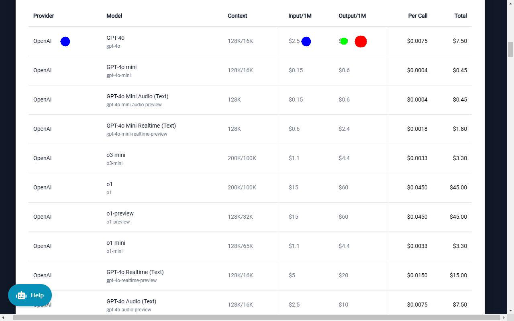
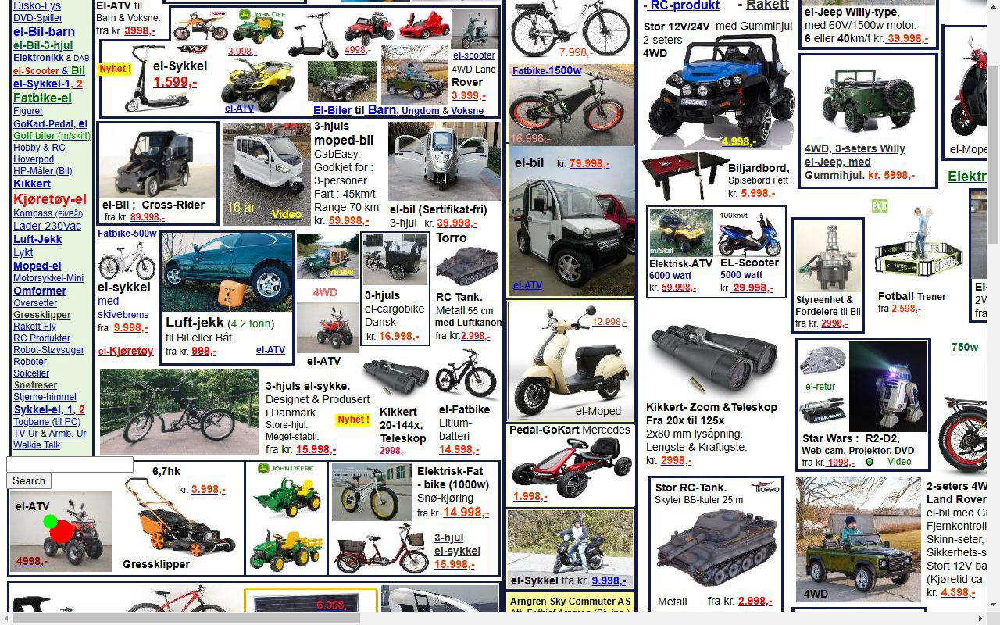
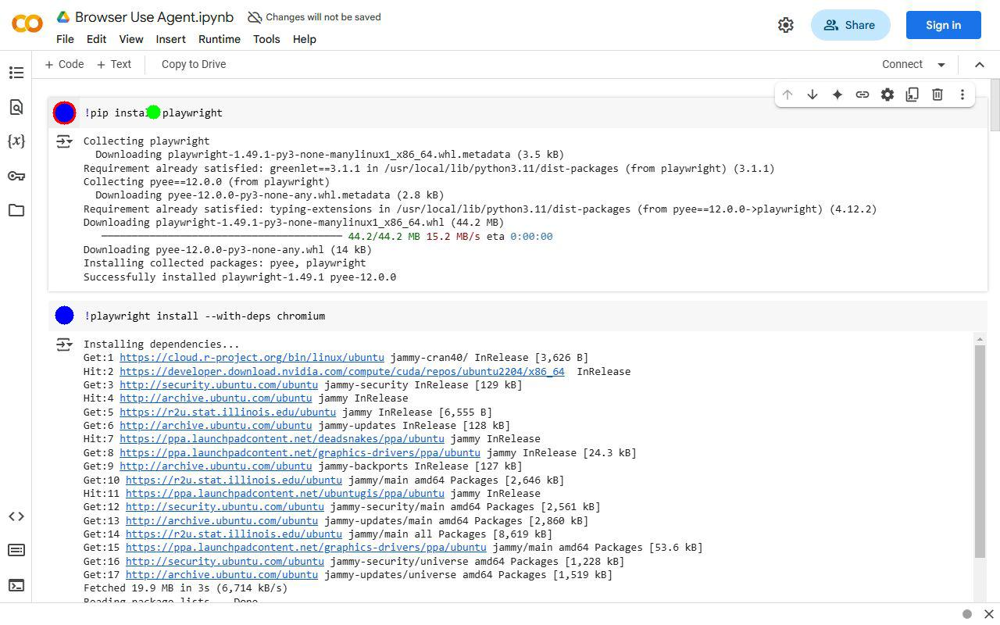

# URL: https://peter.sh/experiments/chromium-command-line-switches/

## Entry 1

**Description**: Locate flag to enable the resume method on animated images

**Coordinates**: X=274.4921875, Y=486.78125

**Scroll To**: X=0, Y=1700

#### `anthropicGroundingLocatr`
- Generated Points:
  - Point 1: X=248, Y=486

- Input Tokens: 1743
- Output Tokens: 44
- Total Tokens: 1787
- Cost in Dollars: 0.005889

#### `originalLocatr`
- Generated Points:
  - Point 1: X=829.2421875, Y=486.78125
  - Point 2: X=829.2421875, Y=486.78125

- Input Tokens: 4609
- Output Tokens: 13
- Total Tokens: 4622
- Cost in Dollars: 0.011652500000000001

### Annotated Screenshot

## Entry 2

**Description**: Find the description of the "--disable-dev-shm-usage" flag

**Coordinates**: X=940.234375, Y=391.28125

**Scroll To**: X=0, Y=10413

#### `anthropicGroundingLocatr`
- Generated Points:
  - Point 1: X=835, Y=391

- Input Tokens: 1748
- Output Tokens: 41
- Total Tokens: 1789
- Cost in Dollars: 0.0058590000000000005

#### `originalLocatr`
- Generated Points:
  - Point 1: X=940.234375, Y=391.28125
  - Point 2: X=274.4921875, Y=391.28125

- Input Tokens: 4833
- Output Tokens: 18
- Total Tokens: 4851
- Cost in Dollars: 0.012262499999999999

### Annotated Screenshot

---

# URL: https://docsbot.ai/tools/gpt-openai-api-pricing-calculator

## Entry 1

**Description**: Locate the button to calculate cost based on word count

**Coordinates**: X=623, Y=676

**Scroll To**: X=17, Y=0

#### `anthropicGroundingLocatr`
- Generated Points:
  - Point 1: X=622, Y=674

- Input Tokens: 1743
- Output Tokens: 44
- Total Tokens: 1787
- Cost in Dollars: 0.005889

#### `originalLocatr`
- Generated Points:
  - Point 1: X=431, Y=676
  - Point 2: X=431, Y=676
  - Point 3: X=431, Y=676

- Input Tokens: 58318
- Output Tokens: 19
- Total Tokens: 58337
- Cost in Dollars: 0.145985

### Annotated Screenshot

## Entry 2

**Description**: Cost of output per million of gpt 4o model

**Coordinates**: X=898.8828125, Y=103

**Scroll To**: X=17, Y=1831

#### `anthropicGroundingLocatr`
- Generated Points:
  - Point 1: X=856, Y=102

- Input Tokens: 1744
- Output Tokens: 41
- Total Tokens: 1785
- Cost in Dollars: 0.005847000000000001

#### `originalLocatr`
- Generated Points:
  - Point 1: X=162.125, Y=103
  - Point 2: X=762.96875, Y=103

- Input Tokens: 3940
- Output Tokens: 18
- Total Tokens: 3958
- Cost in Dollars: 0.010029999999999999

### Annotated Screenshot

---

# URL: https://www.arngren.net/

## Entry 1

**Description**: Locate the red elektrisk ATV vehicle

**Coordinates**: X=78.5, Y=680

**Scroll To**: X=0, Y=238

#### `anthropicGroundingLocatr`
- Generated Points:
  - Point 1: X=64, Y=667

- Input Tokens: 1741
- Output Tokens: 41
- Total Tokens: 1782
- Cost in Dollars: 0.005838

### Annotated Screenshot

## Entry 2

**Description**: Find the price of Kikkert digital camera

**Coordinates**: X=883.484375, Y=64

**Scroll To**: X=700, Y=0

#### `anthropicGroundingLocatr`
- Generated Points:
  - Point 1: X=1113, Y=1598

- Input Tokens: 1742
- Output Tokens: 46
- Total Tokens: 1788
- Cost in Dollars: 0.005915999999999999

#### `originalLocatr`
- Generated Points:
  - Point 1: X=883.484375, Y=64
  - Point 2: X=883.484375, Y=64

- Input Tokens: 5463
- Output Tokens: 21
- Total Tokens: 5484
- Cost in Dollars: 0.0138675

### Annotated Screenshot

---

# URL: https://www.shein.co.uk/

## Entry 1

**Description**: Locate the icon to shop at 60% off

**Coordinates**: X=1227, Y=673.5

**Scroll To**: X=0, Y=6701

#### `anthropicGroundingLocatr`
- Generated Points:
  - Point 1: X=1227, Y=653

- Input Tokens: 1743
- Output Tokens: 45
- Total Tokens: 1788
- Cost in Dollars: 0.005904

### Annotated Screenshot

---

# URL: https://colab.research.google.com/drive/1OqYAKT1OcAiQgIRE5PAAHBI4CB2lG-4n

## Entry 1

**Description**: Button to install the playwright package

**Coordinates**: X=82, Y=144

**Scroll To**: X=0, Y=0

#### `anthropicGroundingLocatr`
- Generated Points:
  - Point 1: X=196, Y=143

- Input Tokens: 1738
- Output Tokens: 44
- Total Tokens: 1782
- Cost in Dollars: 0.005874

#### `originalLocatr`
- Generated Points:
  - Point 1: X=82, Y=403.953125
  - Point 2: X=82, Y=403.953125
  - Point 3: X=82, Y=144

- Input Tokens: 3886
- Output Tokens: 19
- Total Tokens: 3905
- Cost in Dollars: 0.009904999999999999

### Annotated Screenshot

---

